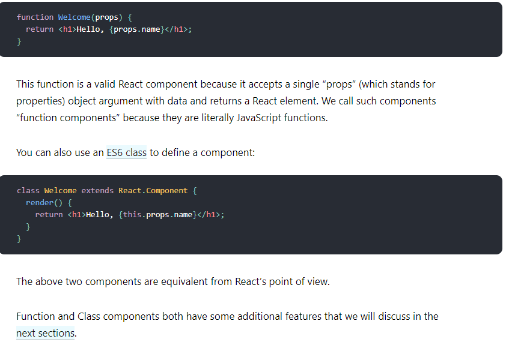

# Read01

## Component-Based Architecture

### What is a component?

Components are independent and reusable bits of code. They serve the same purpose as JavaScript functions, but work in isolation and return HTML via a render() function.

### What are the advantages of using component based architecture?

Ease of deployment − As new compatible versions become available, it is easier to replace existing versions with no impact on the other components or the system as a whole.

Reduced cost − The use of third-party components allows you to spread the cost of development and maintenance.

Ease of development − Components implement well-known interfaces to provide defined functionality, allowing development without impacting other parts of the system.

Reusable − The use of reusable components means that they can be used to spread the development and maintenance cost across several applications or systems.

Modification of technical complexity − A component modifies the complexity through the use of a component container and its services.

Reliability − The overall system reliability increases since the reliability of each individual component enhances the reliability of the whole system via reuse.

System maintenance and evolution − Easy to change and update the implementation without affecting the rest of the system.

Independent − Independency and flexible connectivity of components. Independent development of components by different group in parallel. Productivity for the software development and future software development.

### What is props short for? and How are props used in React?

### What is the flow of props?

that data with props are being passed in a uni-directional flow. (one way from parent to child)

### Introducing JSX

is called JSX, and it is a syntax extension to JavaScript. We recommend using it with React to describe what the UI should look like. JSX may remind you of a template language, but it comes with the full power of JavaScript.

### Rendering an Element into the DOM

Let’s say there is a < div> somewhere in your HTML file:

< div id="root"></ div> We call this a “root” DOM node because everything inside it will be managed by React DOM.

Applications built with just React usually have a single root DOM node. If you are integrating React into an existing app, you may have as many isolated root DOM nodes as you like.

To render a React element into a root DOM node, pass both to ReactDOM.render():

const element = < h1>Hello, world</ h1>; ReactDOM.render(element, document.getElementById('root'));

### Thankyou