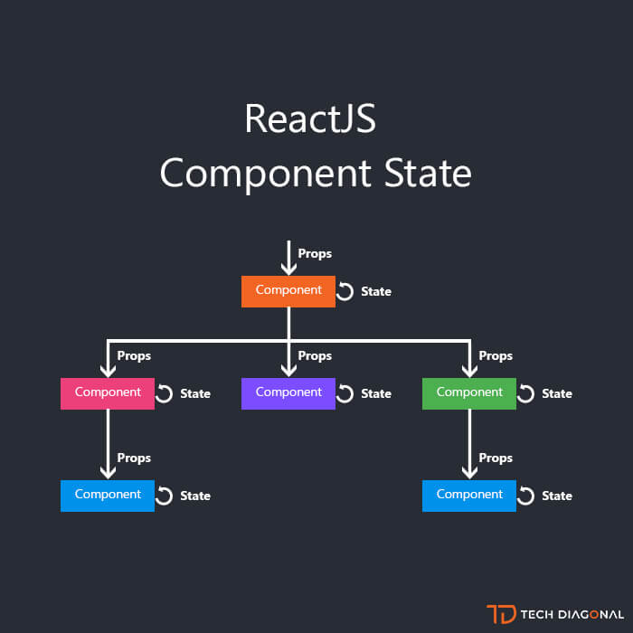

# Read02

## State and Props

## Converting a Function to a Class:

1. import React from 'react'
2. class App extends React.Component
3. render()
4. return
5. contain element in div
6. this.props for passing values

## Handling Events

* Handling events with React elements is very similar to handling events on DOM elements. There are some syntax differences

* React events are named using camelCase, rather than lowercase.

* With JSX you pass a function as the event handler, rather than a string.

## Converting a Function to a Class

we can convert a function component like Clock to a class in five steps:

* Create an ES6 class, with the same name, that extends React.Component.

* Add a single empty method to it called render().

* Move the body of the function into the render() method.

* Replace props with this.props in the render() body.

* Delete the remaining empty function declaration.

## Adding Lifecycle Methods to a Class

* In applications with many components, it’s very important to free up resources taken by the components when they are destroyed.

* We want to set up a timer whenever the Clock is rendered to the DOM for the first time. This is called “mounting” in React.

* We also want to clear that timer whenever the DOM produced by the Clock is removed. This is called “unmounting” in React.

* We can declare special methods on the component class to run some code when a component mounts and unmounts

## Thankyou

